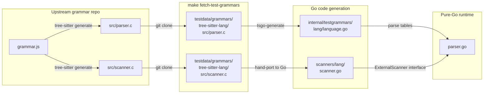

# treesitter-go

A pure-Go implementation of the [tree-sitter](https://tree-sitter.github.io/tree-sitter/) parsing runtime. This library provides incremental, error-recovering, GLR parsing without any C dependencies or cgo.

## Features

- **Pure Go** — no cgo, no C compiler needed, cross-compiles cleanly
- **GLR parsing** — handles ambiguous grammars via graph-structured stack with version forking, merging, and pruning
- **Incremental parsing** — reuses unchanged subtrees from previous parses for fast re-parsing after edits
- **Error recovery** — produces partial parse trees even for syntactically invalid input
- **External scanner support** — grammars with custom lexing logic (heredocs, indentation, etc.) are supported via Go scanner interfaces

## Installation

```bash
go get github.com/treesitter-go/treesitter
```

## Usage

### Basic Parsing

```go
package main

import (
    "context"
    "fmt"

    ts "github.com/treesitter-go/treesitter"
    "github.com/treesitter-go/treesitter/internal/testgrammars/gogrammar"
)

func main() {
    // Create a parser and set the language
    parser := ts.NewParser()
    parser.SetLanguage(gogrammar.GoLanguage())

    // Parse source code
    source := []byte(`package main

func hello() {
    fmt.Println("hello world")
}
`)
    tree := parser.ParseString(context.Background(), source)

    // Walk the tree
    root := tree.RootNode()
    fmt.Println(root.String()) // S-expression output
    fmt.Printf("Root: %s (%d children)\n", root.Type(), root.ChildCount())
}
```

### Navigating the Tree

```go
root := tree.RootNode()

// Access children by index
for i := 0; i < int(root.ChildCount()); i++ {
    child := root.Child(i)
    fmt.Printf("  %s [%d-%d]\n", child.Type(), child.StartByte(), child.EndByte())
}

// Access named children (skips anonymous nodes like punctuation)
for i := 0; i < int(root.NamedChildCount()); i++ {
    child := root.NamedChild(i)
    fmt.Printf("  %s: %s\n", child.Type(), source[child.StartByte():child.EndByte()])
}

// Access children by field name
funcDecl := root.NamedChild(1) // function_declaration
name := funcDecl.ChildByFieldName("name")
fmt.Printf("Function name: %s\n", source[name.StartByte():name.EndByte()])
```

### Incremental Parsing

```go
// After editing the source, create an edit description
edit := &ts.InputEdit{
    StartByte:   42,
    OldEndByte:  47,
    NewEndByte:  52,
    StartPoint:  ts.Point{Row: 3, Column: 4},
    OldEndPoint: ts.Point{Row: 3, Column: 9},
    NewEndPoint: ts.Point{Row: 3, Column: 14},
}

// Apply edit to old tree and re-parse
oldTree := tree.Edit(edit)
newTree := parser.ParseString(context.Background(), newSource, oldTree)
```

## Generation Pipeline

Each supported language starts from an upstream `tree-sitter-{lang}` grammar repo. The pipeline converts the C-generated parser tables into pure Go, while external scanners are hand-ported:



The key steps:

1. **Upstream** — each `tree-sitter-{lang}` repo defines a `grammar.js` and optionally a hand-written `scanner.c`. Running `tree-sitter generate` produces `src/parser.c` (large auto-generated parse tables) and compiles the scanner.
2. **Fetch** — `make fetch-test-grammars` clones the upstream repos (with pre-generated `parser.c`) into `testdata/grammars/`.
3. **Transpile** — `cmd/tsgo-generate` reads `parser.c` and emits an equivalent Go file with the same parse tables as Go data structures. External scanners must be manually ported to Go since they contain arbitrary C logic.
4. **Runtime** — the pure-Go parser engine (`parser.go`) consumes the generated `language.go` tables and calls into Go scanner implementations via the `ExternalScanner` interface.

## Adding a Grammar

To add a new grammar:

1. Obtain the tree-sitter grammar's `parser.c` (usually from the grammar's repo under `src/parser.c`)
2. Run `tsgo-generate -parser src/parser.c -package langgrammar -output language.go`
3. If the grammar has an external scanner (`scanner.c`), port it to Go implementing the `ExternalScanner` interface
4. Add corpus tests from the upstream grammar's `test/corpus/` directory

Pre-built grammars for 15 languages are available in `internal/testgrammars/`.

## Supported Languages

The following grammars are included for testing and can be used as references for adding new grammars:

| Language | Grammar Source | External Scanner |
|----------|---------------|-----------------|
| Go | tree-sitter-go | No |
| C | tree-sitter-c | No |
| C++ | tree-sitter-cpp | Yes |
| Python | tree-sitter-python | Yes |
| JavaScript | tree-sitter-javascript | Yes |
| TypeScript | tree-sitter-typescript | Yes |
| Rust | tree-sitter-rust | Yes |
| Ruby | tree-sitter-ruby | Yes |
| Java | tree-sitter-java | No |
| Perl | tree-sitter-perl | Yes |
| Bash | tree-sitter-bash | Yes |
| HTML | tree-sitter-html | Yes |
| CSS | tree-sitter-css | Yes |
| Lua | tree-sitter-lua | Yes |
| JSON | tree-sitter-json | No |

## Testing

### Test Types

| Test | Command | Content | Requires CLI? | Notes |
|------|---------|---------|:---:|-------|
| **Unit tests** | `make test` | Hand-written tests for parser, lexer, stack, subtree, API, external scanners | No | Skips corpus and differential tests. Tests core runtime behavior with small focused inputs. |
| **Corpus tests** | `make test-corpus` | Tree-sitter's official test suites (1634 cases across 15 languages) | No | Each grammar repo ships a `corpus/` directory with input/expected-output pairs. Fetched with `make fetch-test-grammars` into `testdata/grammars/`. |
| **Regression tests** | `make test-regression` | Curated inputs that previously caused bugs (hangs, panics, wrong output) | No | Stored in `testdata/regression/<lang>/`. Guards against regressions in specific edge cases. |
| **Differential tests** | `make diff-test` | Small set of per-grammar sample inputs compared against C tree-sitter CLI output | **Yes** | Tests in `internal/difftest/`. Verifies our S-expression output matches the C reference exactly. |
| **Corpora diff tests** | `make test-corpora-diff` | Real-world source files from open-source projects compared against C CLI | **Yes** | Fetched via `make fetch-corpora` from GitHub repos. Parses hundreds of real files per language and diffs against C reference output. |
| **Benchmarks** | `make bench` | Auto-generated synthetic inputs (varying sizes per language) | Optional | Measures parse throughput (bytes/sec) for all 15 languages at multiple sizes. If CLI is available, also benchmarks C parser for comparison. |
| **Grammar batch tests** | `go test -run TestGrammarBatch` | Subset of corpus tests used during grammar generation validation | No | Runs during development to verify grammar extraction + code generation. |

### Setup

```bash
# Fetch grammar repos (needed for corpus tests, regression tests)
make fetch-test-grammars

# Install tree-sitter CLI (needed for diff tests, corpora diff tests, CLI benchmarks)
make deps

# Fetch real-world source corpora (needed for corpora diff tests)
make fetch-corpora

# Build grammar dylibs for CLI benchmarks (optional, macOS)
make bench-grammars
```

### Corpus Test Results

Tested against the official tree-sitter corpus tests for all 15 languages:

| Date | Pass | Fail | Total | Pass Rate | Notes |
|------|------|------|-------|-----------|-------|
| 2026-02-16 | 135 | 312 | 447 | 30.2% | Initial corpus (5 languages) |
| 2026-02-16 | 1238 | 381 | 1619 | 76.5% | Alias extraction fix, all 15 languages |
| 2026-02-17 | 1474 | 145 | 1619 | 91.0% | P1 fixes: alias visibility, comment extras, dynprec |
| 2026-02-17 | 1525 | 94 | 1619 | 94.2% | HTML scanner fix, error cost tuning |
| 2026-02-18 | 1585 | 49 | 1634 | 97.0% | handleError rewrite, error recovery improvements |
| 2026-02-18 | 1614 | 20 | 1634 | 98.8% | GLR tree selection, reduce ordering, grammar regen |
| 2026-02-18 | 1615 | 19 | 1634 | 98.8% | DynPrec guard on advance swap |
| 2026-02-24 | 1617 | 17 | 1634 | 99.0% | Error symbol metadata, Strategy 1 split, scanner fixes |
| 2026-02-24 | 1621 | 13 | 1634 | 99.2% | Ruby % strings, keyword matching, TSX grammar |

See `docs/corpus-progress.csv` for detailed per-commit history.

## Architecture

The implementation faithfully ports the C tree-sitter runtime to Go:

- **`parser.go`** — GLR parser with version forking, merging, error recovery
- **`lexer.go`** — DFA-based lexer with keyword extraction and external scanner integration
- **`stack.go`** — Graph-structured stack (GSS) supporting split, merge, pause/resume
- **`subtree.go`** — Arena-allocated subtree nodes with inline optimization for small trees
- **`tree.go`** — Parse tree with Node API for navigation, field access, S-expression output
- **`language.go`** — Language definition holding parse tables, lex tables, symbol metadata
- **`types.go`** — Core types: Symbol, StateID, FieldID, Length, Point, Range

## License

MIT
