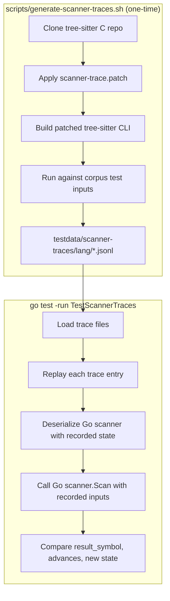

# Scanner Trace Testing Plan

## Problem

External scanner bugs are currently only caught by end-to-end corpus and
differential tests. These tests exercise scanners indirectly through full
parses, which means:

1. Coverage depends on the corpus inputs happening to trigger specific scanner
   states — many edge cases are never hit.
2. When a test fails, it's unclear whether the bug is in the scanner, the
   parser runtime, or the grammar tables.
3. Scanner bugs often manifest as subtle wrong-tree-shape issues rather than
   outright failures, making them hard to detect and diagnose.

## Goal

Build a test harness that validates each Go scanner **in isolation** against
the reference C scanner behavior, independent of the parser runtime. This
creates a direct behavioral contract: given the same inputs (lookahead,
valid symbols, serialized state), the Go scanner must produce the same outputs
(matched symbol, advance count, new state) as the C scanner.

## Approach

### Overview



### Phase 1: Patch the C tree-sitter to log scanner calls

The C tree-sitter parser calls external scanners through a single function
(`ts_parser__external_scanner_scan` in `lib/src/parser.c` line 443). The scan
function receives:

- **`payload`** — opaque scanner state (created by `create()`, restored by
  `deserialize()`)
- **`&lexer.data`** — the TSLexer interface, providing `lookahead` (current
  character) and `advance`/`mark_end`/`result_symbol` methods
- **`valid_external_tokens`** — boolean array of length `external_token_count`,
  indicating which external tokens the parser is willing to accept

The scan function returns `true` if it matched a token (setting
`lexer.result_symbol`) or `false` if it didn't match.

**What to log per invocation:**

```jsonl
{
  "lang": "python",
  "file": "test/corpus/statements.txt",
  "test_name": "If statements",
  "call_index": 42,
  "input": {
    "byte_offset": 156,
    "lookahead": 10,
    "valid_symbols": [false, true, true, false, ...],
    "scanner_state_before": "base64-encoded-bytes"
  },
  "output": {
    "matched": true,
    "result_symbol": 3,
    "token_end_byte": 157,
    "advances": 1,
    "scanner_state_after": "base64-encoded-bytes"
  }
}
```

**Key fields:**

| Field | Source | Purpose |
|-------|--------|---------|
| `byte_offset` | `lexer.current_position.bytes` | Where in the input the scanner was called |
| `lookahead` | `lexer.data.lookahead` | The character the scanner sees first |
| `valid_symbols` | `valid_external_tokens` array | Which tokens the parser will accept |
| `scanner_state_before` | Output of `serialize()` before the call | Scanner state entering the call |
| `matched` | Return value of `scan()` | Whether the scanner found a token |
| `result_symbol` | `lexer.data.result_symbol` | Which external token was matched |
| `token_end_byte` | `lexer.token_end_position.bytes` | Where the matched token ends |
| `advances` | Count of `advance()` calls during scan | How many characters were consumed |
| `scanner_state_after` | Output of `serialize()` after the call | Scanner state exiting the call |

### Phase 2: Build the trace generator script

**File:** `scripts/generate-scanner-traces.sh`

This script is self-contained and idempotent. It:

1. **Clones** the tree-sitter repo (at a pinned version matching our grammar
   dependencies) into a temp directory.
2. **Applies** `scripts/scanner-trace.patch` — a patch file that modifies
   `lib/src/parser.c` to emit JSONL to stderr on every external scanner call.
   The patch wraps `ts_parser__external_scanner_scan` to:
   - Call `serialize()` before the scan to capture pre-state
   - Call the original `scan()`
   - Call `serialize()` after to capture post-state
   - Count `advance()` calls via a wrapper
   - Emit the JSONL line to stderr
3. **Builds** the patched CLI: `cargo build --release`
4. **Runs** the patched CLI against each corpus test input for each language:
   - For each `testdata/grammars/tree-sitter-{lang}/test/corpus/*.txt`, parse
     the corpus file format to extract individual test inputs
   - Write each input to a temp file with the correct extension
   - Run `patched-tree-sitter parse --lib-path <dylib> --lang-name <lang> <file>`
   - Capture stderr (the JSONL trace lines), tag with language/file/test name
   - Append to `testdata/scanner-traces/{lang}.jsonl`
5. **Cleans up** the temp directory.

**Patch design notes:**

The patch needs to intercept at the `ts_parser__external_scanner_scan` call
site (parser.c:545). The approach:

- Add a file-scoped counter for advance calls
- Wrap the lexer's advance callback to increment the counter
- Before calling `scan()`: serialize state, record position/lookahead/valid_symbols
- After `scan()` returns: serialize state again, record result
- Emit JSONL to stderr (stderr so it doesn't interfere with the parse output
  on stdout)

The patch also needs to hook into the corpus test runner or work via the CLI's
`parse` command. Using the CLI's `parse` command with `--lib-path` is simpler
since we already have the dylib build infrastructure from `make bench-grammars`.

**Parsing corpus files:** The upstream corpus format
(`===`/`---` delimited) needs to be parsed to extract individual test inputs.
We can write a small helper (Python or Go) that reads corpus `.txt` files and
emits individual test input files, or we can parse whole files and correlate
trace entries with test boundaries by byte offset.

Simpler approach: just parse whole corpus files as single inputs. The trace
entries include byte offsets, so we can later correlate them with specific
test cases if needed. This avoids needing to re-implement corpus file parsing
in the shell script.

### Phase 3: Commit trace files as golden data

**Directory structure:**
```
testdata/scanner-traces/
    python.jsonl
    bash.jsonl
    javascript.jsonl
    typescript.jsonl
    cpp.jsonl
    rust.jsonl
    ruby.jsonl
    perl.jsonl
    html.jsonl
    css.jsonl
    lua.jsonl
```

Only the 11 languages with external scanners get trace files. Languages without
scanners (JSON, Go, C, Java) have no external scanner calls to trace.

These files are committed to the repo. They only need to be regenerated when:
- Upstream grammar versions are bumped (`make fetch-test-grammars`)
- The tree-sitter runtime version changes (affecting scanner call patterns)
- New corpus tests are added upstream

A Makefile target makes regeneration easy:
```makefile
generate-scanner-traces:
    scripts/generate-scanner-traces.sh
```

### Phase 4: Go test suite for trace replay

**File:** `scanner_trace_test.go`

```go
func TestScannerTraces(t *testing.T) {
    // For each language with an external scanner...
    for _, lang := range scanneredLanguages() {
        traceFile := filepath.Join("testdata", "scanner-traces", lang.name+".jsonl")
        // Skip if trace file doesn't exist (not yet generated)
        if _, err := os.Stat(traceFile); os.IsNotExist(err) {
            t.Skipf("no trace file for %s", lang.name)
        }

        t.Run(lang.name, func(t *testing.T) {
            scanner := lang.newScanner()
            f, _ := os.Open(traceFile)
            decoder := json.NewDecoder(f)

            for decoder.More() {
                var entry TraceEntry
                decoder.Decode(&entry)

                // Deserialize scanner to the recorded pre-state
                scanner.Deserialize(entry.Input.ScannerStateBefore)

                // Build a mock lexer seeded with the recorded input
                lexer := newTraceLexer(entry.Input.ByteOffset,
                    entry.Input.Lookahead, corpusInput)

                // Call Scan with the recorded valid_symbols
                matched := scanner.Scan(lexer, entry.Input.ValidSymbols)

                // Compare results
                assert.Equal(t, entry.Output.Matched, matched)
                if matched {
                    assert.Equal(t, entry.Output.ResultSymbol,
                        lexer.ResultSymbol)
                }

                // Compare post-scan serialized state
                var buf [1024]byte
                n := scanner.Serialize(buf[:])
                assert.Equal(t, entry.Output.ScannerStateAfter,
                    buf[:n])
            }
        })
    }
}
```

**Key design decisions:**

1. **Mock lexer, not the real parser lexer.** The trace replay needs a Lexer
   that reads from the recorded input at the recorded byte offset. We build a
   minimal `traceLexer` that implements the same `Advance`/`MarkEnd`/
   `Lookahead`/`ResultSymbol` interface, fed from the original corpus input
   bytes. This isolates the test from the parser runtime entirely.

2. **State deserialization before each call.** Each trace entry includes the
   full serialized scanner state before the call. We deserialize to that state
   before replaying, so each entry is independently verifiable — a failure in
   one entry doesn't cascade.

3. **Advance count validation.** The trace records how many `advance()` calls
   the C scanner made. We verify the Go scanner makes the same number of
   advances, catching cases where the Go port reads too few or too many
   characters.

## Testing the tests

To validate the trace infrastructure itself:

1. **JSON scanner (no external scanner):** Verify no trace entries are generated.
2. **Known-good language (e.g., Python):** Verify all trace entries pass.
3. **Intentional regression:** Temporarily break a scanner (e.g., change a
   character constant) and verify the trace test catches it.

## Maintenance

When upstream grammars are updated:

```bash
make fetch-test-grammars    # Pull new grammar versions
make bench-grammars         # Rebuild dylibs
make generate-scanner-traces  # Regenerate golden traces
go test -run TestScannerTraces  # Verify Go scanners still match
```

If `TestScannerTraces` fails after a grammar update, it means the upstream
scanner behavior changed and the Go port needs to be updated to match.

## Effort estimate

| Component | Scope |
|-----------|-------|
| C patch (`scanner-trace.patch`) | ~100 lines of C in parser.c |
| Shell script (`generate-scanner-traces.sh`) | ~150 lines |
| Corpus input parser (extract test inputs) | ~50 lines (Go or Python helper) |
| Go test suite (`scanner_trace_test.go`) | ~200 lines |
| Mock/trace lexer | ~100 lines |
| Makefile integration | ~5 lines |

## Documentation

Update the README's Testing section to include the scanner trace tests:

- Add a new row to the test types table:

  | **Scanner trace tests** | `go test -run TestScannerTraces` | Replays recorded C scanner calls against Go scanner implementations | No (uses committed trace files) | Validates each Go external scanner produces identical results to the C reference. Trace files generated with `make generate-scanner-traces`. |

- Add `generate-scanner-traces` to the Setup section:

  ```bash
  # Generate scanner trace golden files (requires Rust/cargo for building
  # patched tree-sitter CLI, plus grammar dylibs from make bench-grammars)
  make generate-scanner-traces
  ```

- Add a note in the Setup section that `make generate-scanner-traces` only
  needs to be re-run when upstream grammar versions change. The committed
  trace files in `testdata/scanner-traces/` are sufficient for normal
  development — `go test -run TestScannerTraces` works without any extra setup
  beyond `make fetch-test-grammars`.

## Open questions

1. **Corpus input access during replay.** The trace entries record byte offsets
   into the input, but the Go test needs the actual input bytes to feed the
   mock lexer. Options:
   - Include a snippet of the surrounding input in each trace entry (bloats
     trace files but makes them self-contained)
   - Have the test load the original corpus files and index by byte offset
     (requires corpus files to be present, which they already are via
     `make fetch-test-grammars`)
   - **Recommended:** Load corpus files at test time. They're already required
     for corpus tests, so this adds no new dependency.

2. **Trace file size.** Some languages (bash, C++) have complex scanners called
   thousands of times per corpus. The JSONL files could be several MB each.
   This is fine for git — they compress well and change infrequently.

3. **Cross-platform dylib extension.** The current `make bench-grammars`
   hardcodes `.dylib` (macOS). The trace generator script should detect the
   platform and use `.so` on Linux. This can be handled with a simple
   `uname` check in the script.
